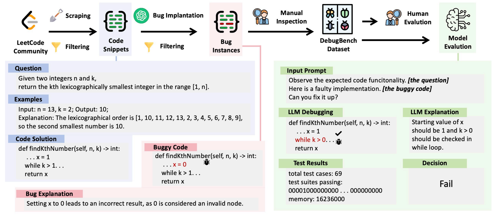

# Repo of DebugBench




Implementation for paper DebugBench: Evaluating Debugging Capabilities of Large Language Models with datasets, prompts, model outputs.


### Citations

Please cite the paper and star the repo if you use DebugBench and find it helpful.

Feel free to contact trc20@mails.tsinghua.edu.cn or open an issue if you have any questions.

```latex
The preprint version is coming soon.
```

